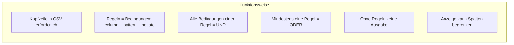

Funktionsweise

```mermaid
graph LR
subgraph Funktionsweise
    FW1[Kopfzeile in CSV erforderlich]
    FW2[Regeln = Bedingungen: column + pattern + negate]
    FW3[Alle Bedingungen einer Regel = UND]
    FW4[Mindestens eine Regel = ODER]
    FW5[Ohne Regeln keine Ausgabe]
    FW6[Anzeige kann Spalten begrenzen]
end
```
