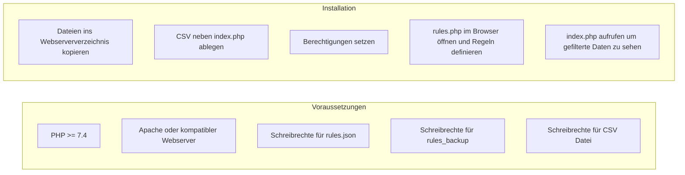

Installation

```mermaid
graph LR
subgraph Voraussetzungen
    V1[PHP >= 7.4]
    V2[Apache oder kompatibler Webserver]
    V3[Schreibrechte für rules.json]
    V4[Schreibrechte für rules_backup]
    V5[Schreibrechte für CSV Datei]
end

subgraph Installation
    I1[Dateien ins Webserververzeichnis kopieren]
    I2[CSV neben index.php ablegen]
    I3[Berechtigungen setzen]
    I4[rules.php im Browser öffnen und Regeln definieren]
    I5[index.php aufrufen um gefilterte Daten zu sehen]
end
```
