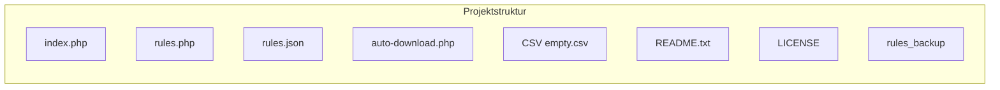

<table width="100%">
  <tr valign="middle">
    <td align="left">
      <a href="inf/05.md">← Zurück</a>
    </td>
    <td align="right">
      <a href="inf/02.md">Weiter →</a>
    </td>
  </tr>
</table>

[📥 Download als ZIP](https://github.com/florianthepro/script/archive/refs/heads/main.zip)

