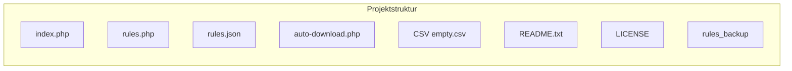

struktur

<table width="100%">
  <tr valign="middle">
    <td align="left">
      <a href="README.md">← Zurück</a>
    </td>
    <td align="right">
      <a href="docs/diagram-projektstruktur.png">Weiter →</a>
    </td>
  </tr>
</table>
