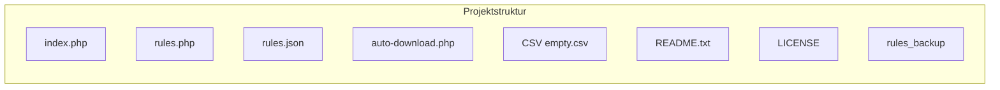
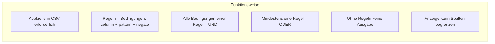
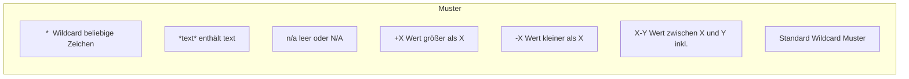
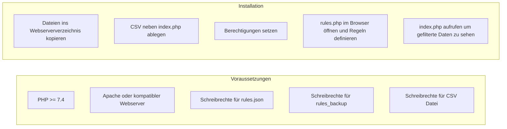
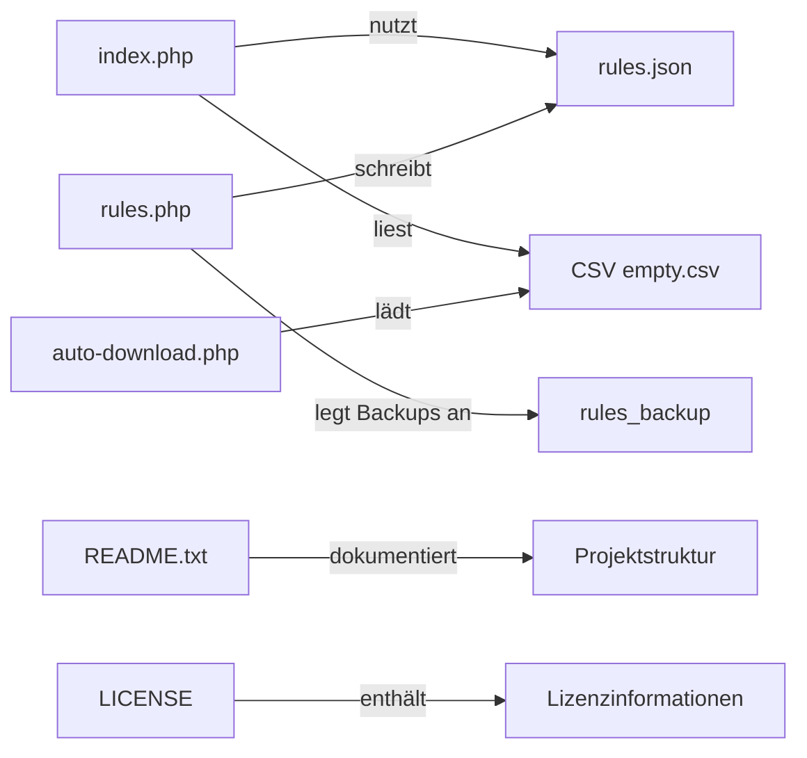

struktur

```mermaid
graph LR
subgraph Projektstruktur
    A[index.php]
    B[rules.php]
    C[rules.json]
    D[auto-download.php]
    E[CSV empty.csv]
    F[README.txt]
    G[LICENSE]
    H[rules_backup]
end
```
Funktionsweise

```mermaid
graph LR
subgraph Funktionsweise
    FW1[Kopfzeile in CSV erforderlich]
    FW2[Regeln = Bedingungen: column + pattern + negate]
    FW3[Alle Bedingungen einer Regel = UND]
    FW4[Mindestens eine Regel = ODER]
    FW5[Ohne Regeln keine Ausgabe]
    FW6[Anzeige kann Spalten begrenzen]
end
```

```mermaid
graph LR
subgraph Muster
    M1[*  Wildcard beliebige Zeichen]
    M2[*text* enthält text]
    M3[n/a leer oder N/A]
    M4[+X Wert größer als X]
    M5[-X Wert kleiner als X]
    M6[X-Y Wert zwischen X und Y inkl.]
    M7[Standard Wildcard Muster]
end
```
Installation

```mermaid
graph LR
subgraph Voraussetzungen
    V1[PHP >= 7.4]
    V2[Apache oder kompatibler Webserver]
    V3[Schreibrechte für rules.json]
    V4[Schreibrechte für rules_backup]
    V5[Schreibrechte für CSV Datei]
end

subgraph Installation
    I1[Dateien ins Webserververzeichnis kopieren]
    I2[CSV neben index.php ablegen]
    I3[Berechtigungen setzen]
    I4[rules.php im Browser öffnen und Regeln definieren]
    I5[index.php aufrufen um gefilterte Daten zu sehen]
end
```
Datenfluss

```mermaid
graph LR
A[index.php] -->|nutzt| C[rules.json]
A -->|liest| E[CSV empty.csv]
B[rules.php] -->|schreibt| C
B -->|legt Backups an| H[rules_backup]
D[auto-download.php] -->|lädt| E
F[README.txt] -->|dokumentiert| Projektstruktur[Projektstruktur]
G[LICENSE] -->|enthält| Lizenzinfo[Lizenzinformationen]
```
