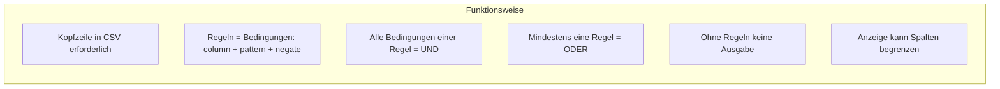

<table width="100%">
  <tr valign="middle">
    <td align="left">
      <a href="03.md">← Zurück</a>
    </td>
    <td align="right">
      <a href="05.md">Weiter →</a>
    </td>
  </tr>
</table>

```mermaid
graph LR
subgraph Funktionsweise
    FW1[Kopfzeile in CSV erforderlich]
    FW2[Regeln = Bedingungen: column + pattern + negate]
    FW3[Alle Bedingungen einer Regel = UND]
    FW4[Mindestens eine Regel = ODER]
    FW5[Ohne Regeln keine Ausgabe]
    FW6[Anzeige kann Spalten begrenzen]
end
```
