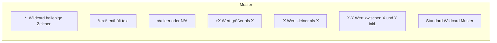

```mermaid
graph LR
subgraph Muster
    M1[*  Wildcard beliebige Zeichen]
    M2[*text* enthält text]
    M3[n/a leer oder N/A]
    M4[+X Wert größer als X]
    M5[-X Wert kleiner als X]
    M6[X-Y Wert zwischen X und Y inkl.]
    M7[Standard Wildcard Muster]
end
```
<table width="100%">
  <tr valign="middle">
    <td align="left">
      <a href="02.md">← Zurück</a>
    </td>
    <td align="right">
      <a href="04.md">Weiter →</a>
    </td>
  </tr>
</table>
