```mermaid
graph LR
A[index.php] -->|nutzt| C[rules.json]
A -->|liest| E[CSV empty.csv]
B[rules.php] -->|schreibt| C
B -->|legt Backups an| H[rules_backup]
D[auto-download.php] -->|lädt| E
F[README.txt] -->|dokumentiert| Projektstruktur[Projektstruktur]
G[LICENSE] -->|enthält| Lizenzinfo[Lizenzinformationen]
```

<table width="100%">
  <tr valign="middle">
    <td align="left">
      <a href="04.md">← Zurück</a>
    </td>
    <td align="right">
      <a href="../README.md">Weiter →</a>
    </td>
  </tr>
</table>

